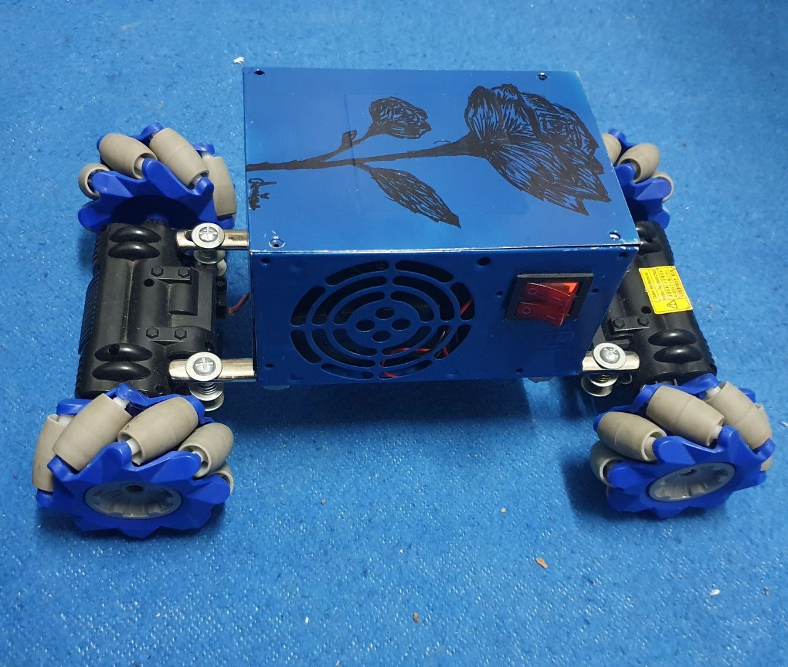
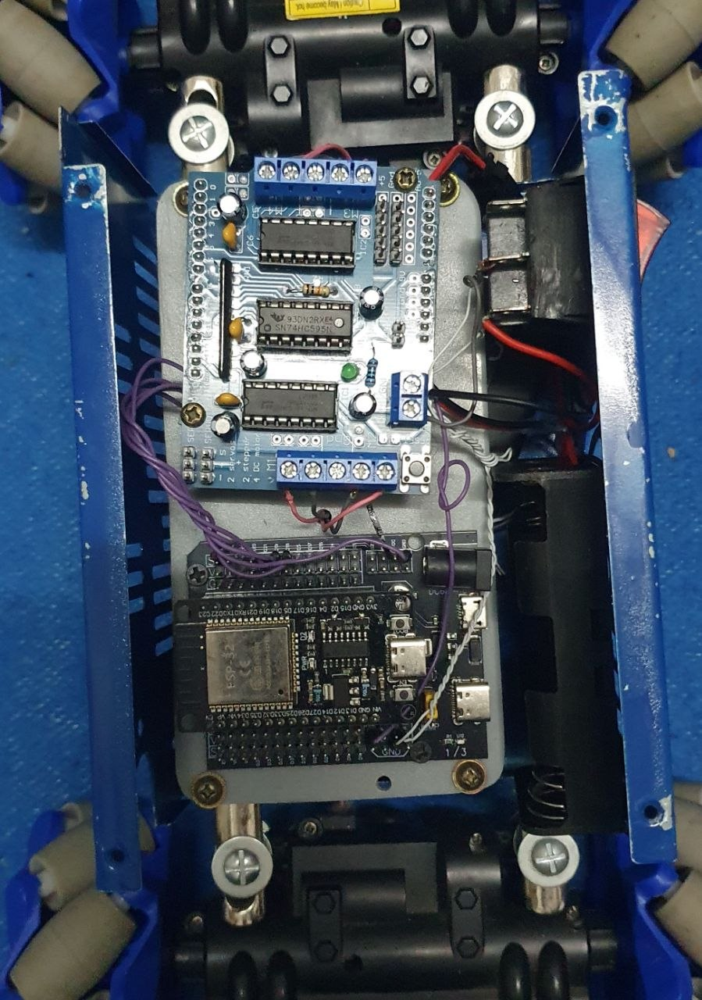

# Mecanum-Wheel-Car-ESP32-L293D-Shield

**A Bluetooth-controlled Mecanum wheel car built by reverse-engineering an Arduino Uno L293D Motor Shield to work with an ESP32.**


*(The car features a repurposed Power Supply Unit (PSU) shell used as the main chassis, housing the ESP32, L293D shield, and wiring).*

---

## 🛠️ Reverse Engineering the L293D Shield
The standard L293D motor shield is designed to plug directly into an Arduino Uno. To make it work with a 3.3V ESP32 without standard libraries, I had to analyze the shield's schematic. 

The shield drives 4 DC motors using two L293D chips, but the direction of these motors is controlled via an onboard **74HC595 Shift Register**. To control the motors, we must send an 8-bit serial command to this shift register.

### ESP32 to 74HC595 Wiring Connections
Based on the trace analysis, here is how the ESP32 connects to the shift register pins on the shield:

| Shield Pin (74HC595) | ESP32 GPIO | Function |
| :--- | :--- | :--- |
| `DIR_SER` | **GPIO 21** | **Serial Data Pin** - Sends the 1s and 0s |
| `DIR_CLK` | **GPIO 19** | **Clock Pin** - Pushes data into the register |
| `DIR_LATCH` | **GPIO 23** | **Latch Pin** - Updates the output pins |
| `DIR_EN` | **GPIO 18** | **Output Enable** - Active LOW to enable motors |

### The 8-Bit Motor Configuration Map
After multiple uploads and hardware testing, I successfully mapped which bit in the shift register controls which motor direction.

| Bit 7 | Bit 6 | Bit 5 | Bit 4 | Bit 3 | Bit 2 | Bit 1 | Bit 0 |
| :---: | :---: | :---: | :---: | :---: | :---: | :---: | :---: |
| M3_CW | M4_CCW| M3_CCW| M2_CW | M1_CW | M1_CCW| M2_CCW| M4_CW |

*   `CW` = Clockwise
*   `CCW` = Counter-Clockwise

---

## 💻 Code Explanation Step-by-Step

### 1. Direct GPIO Manipulation for Speed
Instead of using standard `digitalWrite()`, the code uses ESP32 direct register writing (`GPIO.out_w1ts` and `GPIO.out_w1tc`). This makes the clock pulses significantly faster, allowing rapid updates to the shift register.
```cpp
#define SET_HIGH(pin) GPIO.out_w1ts = (1 << pin)
#define SET_LOW(pin)  GPIO.out_w1tc = (1 << pin)
```

### 2. Writing Data to the Shift Register

The `writeMotor()` function takes the 8-bit command, reads it bit-by-bit (using bitwise `& 0x80`), sets the Data pin, and pulses the Clock pin. Once all 8 bits are in, it pulses the Latch pin to execute the movement.

```cpp
void writeMotor(uint8_t control) {
  for (int i = 0; i < 8; ++i) {
    if (control & 0x80) SET_HIGH(SerialPin);
    else                SET_LOW(SerialPin);
    pulseFast(ClockPin);
    control <<= 1;
  }
  pulseFast(LatchPin);
}
```

### 3. Bluetooth Serial Control
The ESP32 uses classic Bluetooth (`BluetoothSerial`). It listens for a single character command sent from a smartphone (e.g., `'F'` for Forward) and triggers the corresponding bitmask.

## 🛞 Mecanum Wheel Kinematics
Mecanum wheels allow the car to move in any direction (omnidirectional) without turning its orientation. This is achieved by spinning the 4 wheels in specific combinations.

Here is how the logic works based on my code implementation:

| Command | Action | Motor Configuration (M1, M2, M3, M4) |
| :--- | :--- | :--- |
| **F** | Forward | All CW |
| **B** | Backward | All CCW |
| **L** | Strafe Left | M1 CW, M2 CCW, M3 CW, M4 CCW |
| **R** | Strafe Right | M1 CCW, M2 CW, M3 CCW, M4 CW |
| **W/X/Y/Z** | Diagonal Movements | Running only two diagonal motors at a time |
| **M / K** | Rotate in place | Left wheels CW, Right wheels CCW (and vice versa) |
| **S** | Stop | Send `0b00000000` to stop all power |


## 📂 Repository Structure

Here is how the project files are organized so you can easily find what you need:

```text
Mecanum-Wheel-Car-ESP32-L293D-Shield/
│
├── 💻 Firmware/               # ESP32 Source Code
│   └── Mecanum_ESP32.ino      # Main Arduino/C++ code
│
├── 🔌 Hardware/               # Electronics and Design Files
│   ├── components/            # Datasheets and part lists
│   └── schematics/            # Wiring diagrams and pinouts
│
├── 🖼️ Assets/                 # Images and media for documentation
│   └── (build photos, etc.)
│
└── 📄 README.md               # This documentation file
